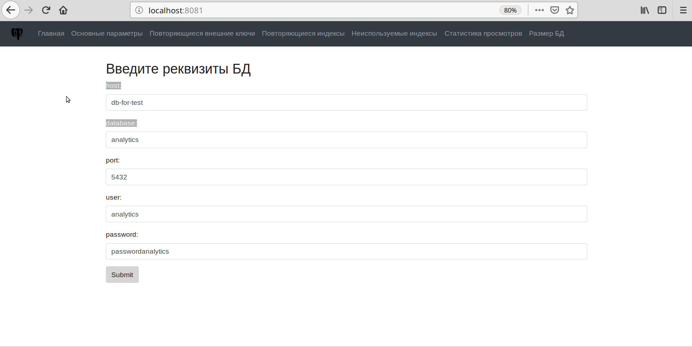

# pgslowpoke
  Инструмент для поиска в схеме БД слабых мест. 
  Неиспользуемые индексы. 
  Поиск повторяющихся индексов. 
  Поиск повторяющихся внешних ключей. 
  Проверка sequence.
  Поиск циклических ссылок.
  
## Запуск приложения
```
./gradlew clean
./gradlew build
docker-compose build
docker-compose up -d
```


###  Поиск повторяющихся индексов
http://localhost:8081/indexduplicate

###  Поиск повторяющихся внешних ключей
http://localhost:8081/foreignkeyduplicate

### Основные параметры кластера
http://localhost:8081/pgsettings

### Неиспользуемые индексы
http://localhost:8081/indexunused

### Статистика просмотров только пользовательских таблиц
http://localhost:8081/pgstatusertables

### Размер БД, таблиц и индексов
http://localhost:8081/dbsize

## Contributing

1. Сделать Fork
2. Создайте свою ветку (`git checkout -b pgslowpoke-new-feature`)
3. Сделайте commit своих изменений  (`git commit -am 'Add some feature'`)
4. Сделайте push (`git push origin pgslowpoke-new-feature`)
5. Создайте новый Pull Request

## Демо

